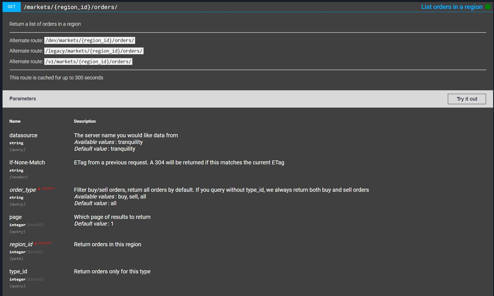
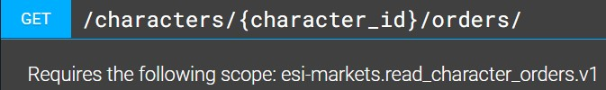
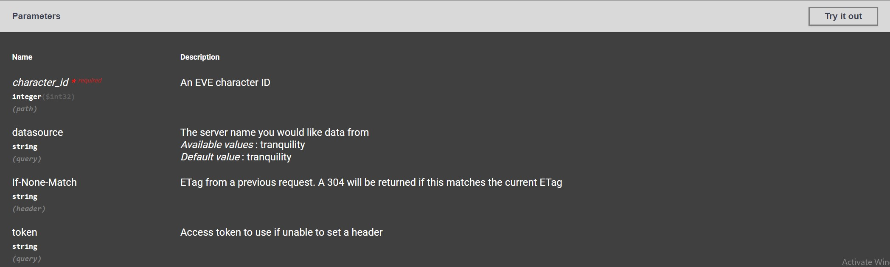
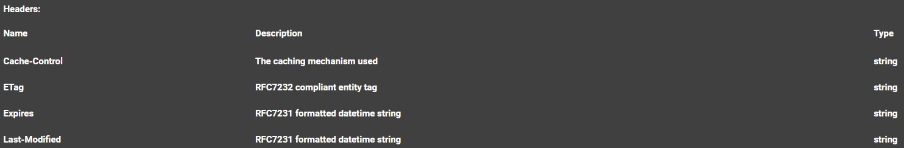
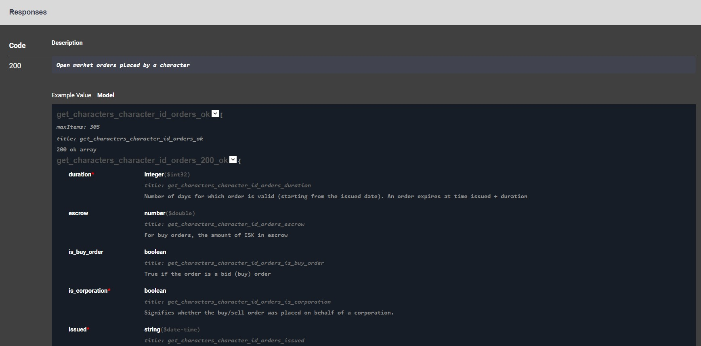

Understand endpoints
====================

Endpoint is where ESI connects to your program. EVE developers have already hidden all the complexities for us, so we don't need to have any knowledge on the backend of the game to access its data.
ESI endpoints are classified into categories, such as ``Market`` and ``Character``, and there are a few endpoints within each category, such as ``/markets/{region_id}/orders/`` under "Market" category. 

Each endpoint comes with its documentation, which highlights some important info of the endpoint. Let's take ``/markets/{region_id}/orders/`` as an example:

This is what shows up when you click on the endpoint. The following subsections will explain each field. 

.. _Endpoint request method:

Endpoint request method
-----------------------

Each endpoint has one or more request method. Most of them are GET, such as GET market data, some are POST, PUT, or DELETE. Most endpoints have only one request method, some unique methods, 
such as ``/characters/{character_id}/contacts/`` under Contacts, have all GET, POST, DELETE, PUT. But these are only helpful in limited ways, so you probably will not encounter them. 

For ``/markets/{region_id}/orders/`` endpoint, the request method is GET. When using python requests or other tools like EVE Tools, you will need to identify which method to use. For example:

.. code-block:: python

    >>> import requests
    >>> resp = requests.get("https://esi.evetech.net/latest/markets/10000002/orders/?datasource=tranquility&order_type=all&page=1")
    >>> print(resp.json())
    [{'duration': 90, 'is_buy_order': False, 'issued': '2022-04-04T15:43:52Z', 'location_id': 60003760, 'min_volume': 1, 'order_id': 6232735753, 'price': 17800.0, 'range': 'region', 'system_id': 30000142, 'type_id': 6173, 'volume_remain': 1, 'volume_total': 1}, 
     {'duration': 30, 'is_buy_order': False, 'issued': '2022-05-28T17:46:33Z', 'location_id': 60003760, 'min_volume': 1, 'order_id': 6270484490, 'price': 69000000.0, 'range': 'region', 'system_id': 30000142, 'type_id': 20569, 'volume_remain': 6, 'volume_total': 6}, 
     ...]

or use EVE Tools:

.. code-block:: python

    >>> from eve_tools import ESIClient
    >>> resp = ESIClient.get("/markets/{region_id}/orders/", region_id=10000002)
    >>> print(resp)
    [{'duration': 90, 'is_buy_order': False, 'issued': '2022-04-04T15:43:52Z', 'location_id': 60003760, 'min_volume': 1, 'order_id': 6232735753, 'price': 17800.0, 'range': 'region', 'system_id': 30000142, 'type_id': 6173, 'volume_remain': 1, 'volume_total': 1}, 
     {'duration': 30, 'is_buy_order': False, 'issued': '2022-05-28T17:46:33Z', 'location_id': 60003760, 'min_volume': 1, 'order_id': 6270484490, 'price': 69000000.0, 'range': 'region', 'system_id': 30000142, 'type_id': 20569, 'volume_remain': 6, 'volume_total': 6}, 
     ...]

For a GET request, you should not use post or other request method, for example:

.. code-block:: python

    >>> import requests
    >>> resp = requests.post("https://esi.evetech.net/latest/markets/10000002/orders/?datasource=tranquility&order_type=all&page=1")
    >>> resp.raise_for_status()
    requests.exceptions.HTTPError: 405 Client Error: Method Not Allowed for url: https://esi.evetech.net/latest/markets/10000002/orders/?datasource=tranquility&order_type=all&page=1

Authentication
--------------

ESI endpoints are either authenticated or unauthenticated. ESI uses authentication tokens to identify each user/player and determine whether you have access to the endpoint.
Authenticated endpoints require you to "log in" your EVE account and grant access to some of your info. Unauthenticated endpoints provide data to all players, regardless of your corporation, alliance, and other status.

Endpoint that needs authentication has a little **lock icon** |auth_lock| on the right:

while endpoint that does not need authentication does not, such as ``/markets/{region_id}/orders/`` in subsection :ref:`Endpoint request method`.

You might have used other applications that needs you to log in. This is when the application generates the authentication token for you and give it to ESI to identify you.
Usually, after logging in, the application provides better and more powerful functionalities with the data you granted. 

.. note:: 
    * Applications will always have access to your data unless you revoke its access. 
    * Authentication tokens have 20 minutes lifespan, after which the application needs to refresh the auth token to continue its lifespan.
    * Applications could store you tokens if they want to, which is how major alliances track you down. This is probably why you want to use open source applications.

To perform authentication, web-based applications asks you to log into your EVE account throug a "Login" button. Local application, such as EVE Tools, has a different process.
In general, the authentication process generates a URL that you need to visit. After logging into your EVE account, you will be redirected to a callback url, where the auth token resides.
Web-based application redirects back to the webpage, while local application might need you to manually copy-paste the URL to the application.

To dive deeper into ESI SSO authorization, you can try with `esi-docs <https://docs.esi.evetech.net/docs/sso/sso_authorization_flow.html>`_.

Scope
-----

The scope summarizes a collection of data that the endpoint can access. Each authenticated endpoint needs authentication in exactly one scope. 
In the authentication process, you grant the application access to some scopes. The application can then retrieve authenticated data from ESI with the scope granted.
Without authentication, the application can not retrieve the data it needs, reducing its functionalities.

An example of an ESI scope: esi-markets.read_character_orders.v1. This scope grants the application access to the character's active orders. 

Each authenticated endpoint has one line below the endpoint name, telling which scope is required:

You will encounter these scope names when creating developer applications in `EVE Developer <https://developers.eveonline.com/>`_. 
This is where developers ask for scopes from their users. 

Parameters
----------

Each endpoint requires some parameters. Some parameters are optional, some are required. Some parameters are integers, some are strings, some are even lists. 
You will need to provide all required parameters to the endpoint, or a 400 error (bad request) would be raised. You usually don't need to fillout optional parameters,
such as ``datasource``, ``If-None-Match``, and ``token``, because you can either use their default values or pass them in headers.

Parameters for endpoint ``/characters/{character_id}/orders/`` are as above. You can see that ``character_id`` is a required field, while all other params are optional. 
You can use the "Try it out" button on the top right to play/test with the endpoint. 

.. note::
    * "Try it out" in authenticated endpoint needs you to log into ESI page. Click the "AUTHORIZE" button on the top right of the page, choose the scopes, click "authorize" on the bottom. 

When using ESI related packages, you will need to fill out the parameters, similar to how you play with "Try it out". For example with EVE Tools:

.. code-block:: python

    >>> from eve_tools import ESIClient
    >>> resp = ESIClient.get("/characters/{character_id}/orders/", character_id=2116658732)

If you do not provide required parameters, such as ``character_id`` in the previous example, you will get an error:

.. code-block:: python

    >>> from eve_tools import ESIClient
    >>> resp = ESIClient.get("/characters/{character_id}/orders/")
    KeyError: Missing key "character_id" in keywords.

.. note::
    As of this `pull request <https://github.com/evetools-dev/eve_tools/pull/5>`_, ``character_id`` is not required for authenticated endpoints. 
    ``ESI.request`` family uses ``character_id`` of the character used for authentication.

Responses
---------

Each endpoint has a collection of responses. Just like HTTP response, each response has a code and its response body. Reading through response contents help you understand what to expect from the endpoint.
Let's take responses of ``/characters/{character_id}/orders/`` as an example.

Headers
^^^^^^^

Headers is an important part of response because it contains useful info of the response object. For GET request, response with code 200 (and sometimes 304) would have a response headers. 
For POST/PUT/DELETE requests, response usually do not contain useful headers (intuitive guess, not for sure).

Expires
    ``headers["expires"]``: A formatted timestring: Fri, 24 Jun 2022 19:13:30 GMT. After this time, the endpoint will be updated with new data and a new ``Expires`` field.

Last-Modified
    ``headers["last-modified"]``: A formatted timestring: Fri, 24 Jun 2022 19:08:30 GMT. The time when the current response body was updated. 

X-Pages
    ``headers["x-pages"]``: The number of pages to loop through in ``page`` parameter. Endpoints with a ``page`` parameter contains ``x-pages`` in its response headers.

headers["x-esi-error-limit-remain"]
    The errors the user can make in the time window, defined in ``headers["x-esi-error-limit-reset"]``. Every error (code 4xx & 5xx) counts against error-limit-remain; when this value reaches 0, a 420 error (Error limited) will be given. 
    See `this <https://developers.eveonline.com/blog/article/error-limiting-imminent>`_ and `that <https://developers.eveonline.com/blog/article/esi-error-limits-go-live>`_ EVE Dev blog for more info.

Code 200
^^^^^^^^

This is a part of response body with code 200. For a GET request, code 200 means the request is successful. Fields marked with a :red:`red asterisk` are always included in the response body regardless of the parameters,
such as ``duration``, ``is_corporation``, ``issued``, etc., in this example. Fields without a red asterisk are not guaranteed and not always included, 
so they need to be taken care of. 

Each field has a data type, usually self explanatory. For example, ``duration`` has data type ``integer($int32)``. Some fields have a ``Enum`` field, specifying the rage of values the field could take from.
The data type field is useful in checking response body. Usually, pandas could serialize the response body correctly, but it is still a good practice to check them with the response data type field.

Each field also has a short description containing useful info of the field. It explains the field in English. For example, ``escrow`` field has description: "For buy orders, the amount of ISK in escrow."

Various ids
-----------

Many users of ESI confuse about all kinds of ids: character_id, type_id, region_id, etc. They are numbers that are used to identify items in EVE. 
For example, Jita has ``region_id = 10000002``, ishtar has ``type_id = 12005``. 

All these item-ids mapping comes from `CCP Static Data Export <https://developers.eveonline.com/resource/resources>`_,
and conversions to other file format are made available by the legendary `fuzzwork <https://www.fuzzwork.co.uk/dump/>`_.
These websites could seem intimidating, so `Adam4EVE <https://www.adam4eve.eu/info_locations.php>`_ makes them available and searchable with a clean display.
When you google "eve type id" or "eve region id", Adam4EVE is a reachable website to find the ids you need.

Alternatively, ESI provides endpoints to retrieve ids from their names. They are ``/search/`` and ``/characters/{character_id}/search/`` endpoints under ``Search`` category.
EVE Tools have integrated searches in functions:

Search for Jita's system_id:

.. code-block:: python

    >>> from eve_tools import search_id
    >>> resp = search_id("Jita", "solar_system")
    >>> print(resp)
    30000142

Search The Forge's region_id:

.. code-block:: python

    >>> from eve_tools import search_id
    >>> resp = search_id("The Forge", "region")
    >>> print(resp)
    10000002

Search Ishtar's type_id:

.. code-block:: python

    >>> from eve_tools import search_id
    >>> resp = search_id("Ishtar", "inventory_type")
    >>> print(resp)
    12005